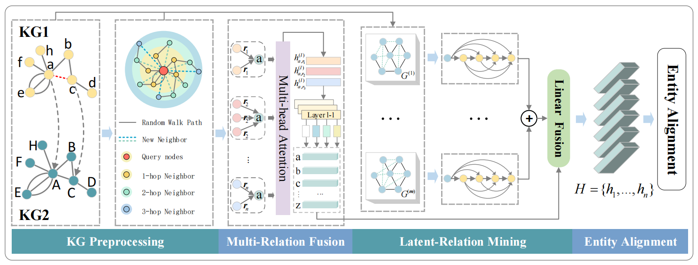

# MFLM-GCN

This repository is the official implementation of MFLM-GCN, the method proposed in paper [***MFLM-GCN: Multi-relation Fusion and
Latent-relation Mining Graph Convolutional Network for Entity Alignment***].

> Entity Alignment (EA) is the task of identifying equivalent entities in two knowledge graphs (KGs) using a limited
set of seed entities. It plays a crucial role in knowledge fusion applications. Many current studies mainly use graph neural
networks (GNN) to aggregate features from the neighborhood relationships of entities for entity representation and to achieve
better entity alignment. However, most existing methods are limited in multi-relation fusion and latent-relation mining of
entities and cannot fully utilize additional information for entity
representation. Therefore, this paper proposes a novel multirelation fusion and latent-relation mining graph convolutional
network (MFLM-GCN) for entity alignment. Specifically, to obtain better entity embedding, we first construct the connection
between two knowledge graphs through seed entity pairs and utilize the local isomorphism between them to enhance semantic
consistency. Second, we capture potentially significant related
entities through graph random walks and fuse multiple relationships in a local and global manner to obtain a preliminary
representation of entities. Third, to capture deeper latent relationships, we adopt a multi-head attention mechanism to generate
multiple full association graphs representing the correlations between entities. Fourth, to improve the information aggregation
performance, we prune all fully related graphs based on previous graph random walk results and build densely connected layers
to capture latent relationships to obtain multi-branch representations of entities. Finally, we use linear fusion to obtain
the final embedding of entities and achieve entity alignment.




## Environment

The essential packages and recommened version to run the code:

- python3 (>=3.7)
- pytorch (1.13.1+cu116)
- numpy   (1.21.5)
- torch-scatter (2.1.0, see the following)
- scipy  (1.7.3)
- tensorflow (1.14.0)
- dgl   (1.1.2+cu116)
- tabulate  (0.8.9)

You can install torch-scatter using this line:
```
$ pip install torch-scatter==2.1.0 -f https://data.pyg.org/whl/torch-1.13.1+cu116.html
```
Replace `https://data.pyg.org/whl/torch-1.13.1+cu116.html` with your configured torch version (check using `print(torch.__version__)`).

## Run MFLM-GCN 

Download this project.

```python
 - MFLM-GCN/     
     |- datasets/   
     |- model/    
     |- pyrwr/
     |- src/  
```

We provide a demo in `src/main.py` to run MFLM on ZH-EN dataset. The hyperparameters can reproduce the results in paper.  Run:

```
$ python main.py
```

## Acknowledgment

MFLM-GCN is designed upon the static entity alignment model [ContEA](https://github.com/nju-websoft/ContEA) (implemented in pytorch). We thank them for making the code open-sourced.


